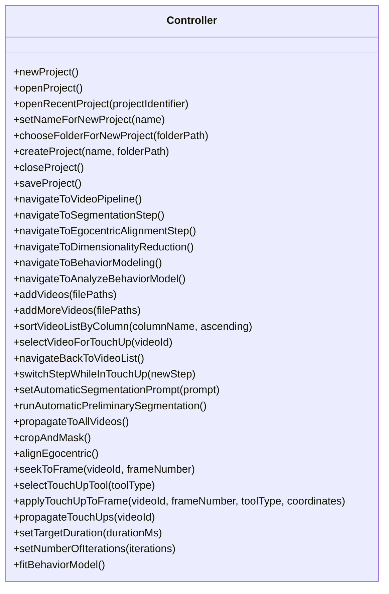

# Class Diagram

```mermaid
classDiagram
    class Controller {
        +newProject()
        +openProject()
        +openRecentProject(projectIdentifier)
        +setNameForNewProject(name)
        +chooseFolderForNewProject(folderPath)
        +createProject(name, folderPath)
        +closeProject()
        +saveProject()
        +navigateToVideoPipeline()
        +navigateToSegmentationStep()
        +navigateToEgocentricAlignmentStep()
        +navigateToDimensionalityReduction()
        +navigateToBehaviorModeling()
        +navigateToAnalyzeBehaviorModel()
        +addVideos(filePaths)
        +addMoreVideos(filePaths)
        +sortVideoListByColumn(columnName, ascending)
        +selectVideoForTouchUp(videoId)
        +navigateBackToVideoList()
        +switchStepWhileInTouchUp(newStep)
        +setAutomaticSegmentationPrompt(prompt)
        +runAutomaticPreliminarySegmentation()
        +propagateToAllVideos()
        +cropAndMask()
        +alignEgocentric()
        +seekToFrame(videoId, frameNumber)
        +selectTouchUpTool(toolType)
        +applyTouchUpToFrame(videoId, frameNumber, toolType, coordinates)
        +propagateTouchUps(videoId)
        +setTargetDuration(durationMs)
        +setNumberOfIterations(iterations)
        +fitBehaviorModel()
    }
```

