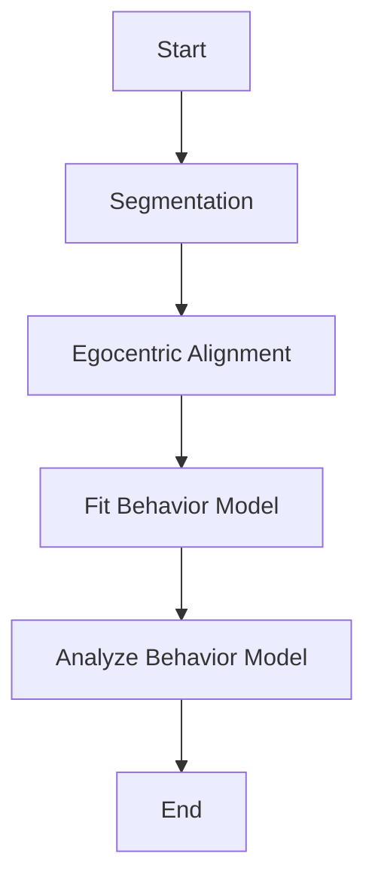

# Pipeline Steps

This flowchart is the high-level view of the data processing steps that a project goes through. Users can edit or re-run steps so in practice the workflow is not always linear as shown, but this is the logic flow of inputs and outputs between pipeline steps.

