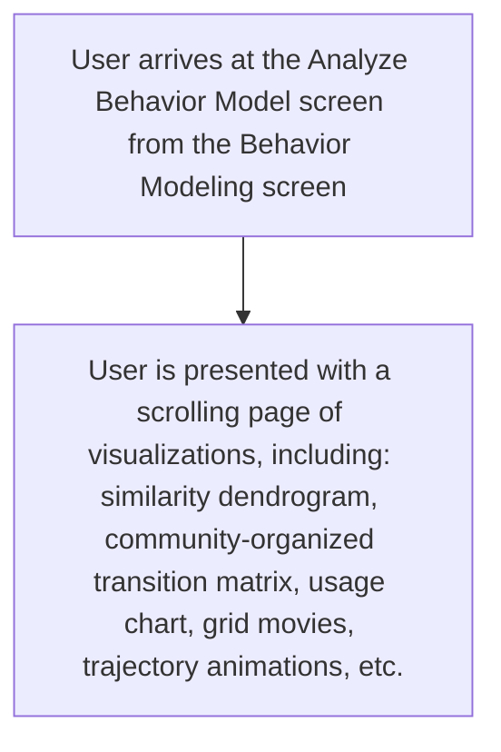

```mermaid
flowchart TD
    A[User arrives at the Analyze Behavior Model screen from the Behavior Modeling screen]
    B[User is presented with a scrolling page of visualizations, including: similarity dendrogram, community-organized transition matrix, usage chart, grid movies, trajectory animations, etc.]

    A --> B
```