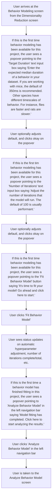

```mermaid
flowchart TD
    A[User arrives at the Behavior Modeling screen from the Dimensionality Reduction screen]
    B[If this is the first time behavior modeling has been available for this project, the user sees a popover pointing to the 'Target Duration' text input box saying 'Enter the expected median duration of a behavior in your dataset. If you are working with mice, the default of 350ms is recommended. Other species have different timescales of behavior. For instance, flies are faster and rats are slower.']
    C[User optionally adjusts default, and clicks okay on the popover]
    D[If this is the first tim behavior modeling has been available for this project, the user sees a popover pointing to the 'Number of Iterations' text input box saying 'Adjust the number of iterations that the model will run. The default of 100 is usually performant.']
    E[User optionally adjusts defautl, and clicks okay on the popover]
    F[If this is the first time behavior modeling has been available for this project, the user sees a popover pointing to the 'Fit Behavior Model' button saying 'It's time to fit your model! Go ahead and click here to start.']
    G[User clicks 'Fit Behavior Model']
    H[User sees status updates on automatic hyperparameter adjustment, number of iterations complete/total, etc.]
    I[If this is the first time a behavior model has finished fitting in this project, the user sees a popover pointing to 'Analyze Behavior Model' in the left navigation bar saying 'Model fitting has completed. Click here to start analyzing the results.']
    J[User clicks 'Analyze Behavior Model' in the left navigation bar]
    K[User is taken to the Analyze Behavior Model screen]

    A --> B
    B --> C
    C --> D
    D --> E
    E --> F
    F --> G
    G --> H
    H --> I
    I --> J
    J --> K
```