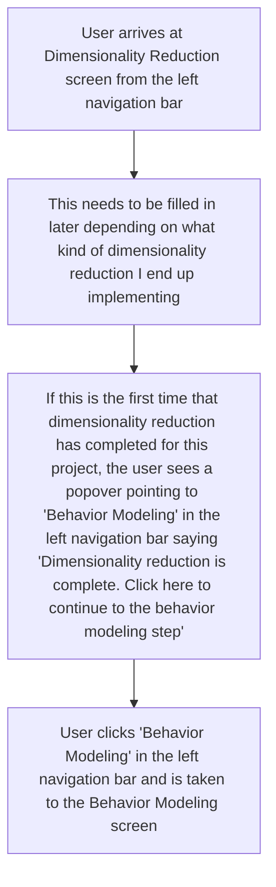

```mermaid
flowchart TD
    A[User arrives at Dimensionality Reduction screen from the left navigation bar]
    B[This needs to be filled in later depending on what kind of dimensionality reduction I end up implementing]
    C[If this is the first time that dimensionality reduction has completed for this project, the user sees a popover pointing to 'Behavior Modeling' in the left navigation bar saying 'Dimensionality reduction is complete. Click here to continue to the behavior modeling step']
    D[User clicks 'Behavior Modeling' in the left navigation bar and is taken to the Behavior Modeling screen]

    A --> B
    B --> C
    C --> D
```