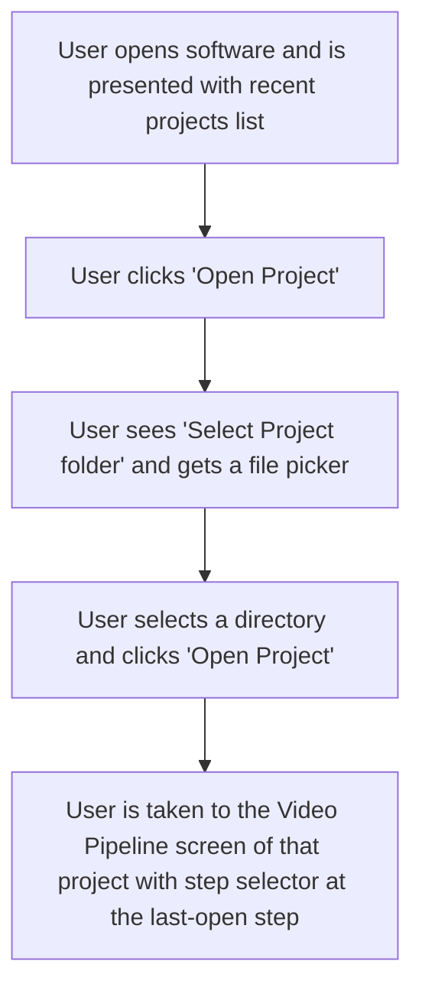

```mermaid
flowchart TD
    A[User opens software and is presented with recent projects list]
    B[User clicks 'Open Project']
    C[User sees 'Select Project folder' and gets a file picker]
    D[User selects a directory and clicks 'Open Project']
    E[User is taken to the Video Pipeline screen of that project with step selector at the last-open step]

    A --> B
    B --> C
    C --> D
    D --> E
```

