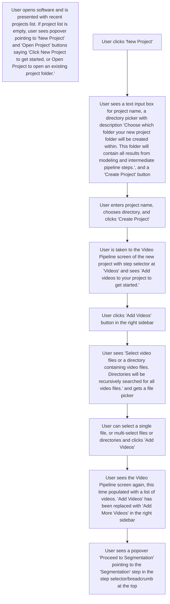

```mermaid
flowchart TD
    A[User opens software and is presented with recent projects list. If project list is empty, user sees popover pointing to 'New Project' and 'Open Project' buttons saying 'Click New Project to get started, or Open Project to open an existing project folder.']
    B[User clicks 'New Project']
    C[User sees a text input box for project name, a directory picker with description 'Choose which folder your new project folder will be created within. This folder will contain all results from modeling and intermediate pipeline steps.', and a 'Create Project' button]
    D[User enters project name, chooses directory, and clicks 'Create Project']
    E[User is taken to the Video Pipeline screen of the new project with step selector at 'Videos' and sees 'Add videos to your project to get started.']
    F[User clicks 'Add Videos' button in the right sidebar]
    G[User sees 'Select video files or a directory containing video files. Directories will be recursively searched for all video files.' and gets a file picker]
    H[User can select a single file, or multi-select files or directories and clicks 'Add Videos']
    I[User sees the Video Pipeline screen again, this time populated with a list of videos. 'Add Videos' has been replaced with 'Add More Videos' in the right sidebar]
    J[User sees a popover 'Proceed to Segmentation' pointing to the 'Segmentation' step in the step selector/breadcrumb at the top]

    B --> C
    C --> D
    D --> E
    E --> F
    F --> G
    G --> H
    H --> I
    I --> J
```

