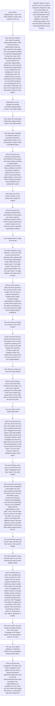

```mermaid
flowchart TD
    A[User selects 'Segmentation' step in the Video Pipeline screen step selector at the top]
    B["User sees list of videos with columns tracking segmentation steps. If this is the first time the Segmentation step has been visited for this project, user sees popover pointing to 'Automatic Segmentation Prompt' text input in the right sidebar saying 'Enter a text prompt for the automatic segmentation algorithm to use to perform a preliminary segmentation of your subject from the background. If you are working with mice, the default is fine. If you are working with other rodents, we recommend keeping the 'excluding tail' part of the prompt. Otherwise, just type in the subject that you would like to detect in your videos.'"]
    C["Optionally, the user changes the default 'Automatic Segmentation Prompt' in the right sidebar"]
    D["User clicks 'Run Automatic Preliminary Segmentation' button in the right sidebar"]
    E[User sees status updates on individual videos as automatic preliminary segmentation starts to run. Eventually, all videos show a completed status.]
    F["If this is the first time automatic segmentation has finished for this project, user sees popover pointing to segmentation confidence columns like 'mean confidence' and '5th percentile confidence' saying 'Now it's time to touch up the preliminary segmentations. Sort any of these columns by least to most confident to find problematic videos'"]
    G[User clicks one of the column headers to sort values from smallest to largest]
    H["If this is the first time automatic segmentation has finished for this project, user sees a popover pointing to the first video in the list saying 'Double-click a video to open it in the touch-up view for full-body segmentation editing'"]
    I[User double-clicks a video from the list]
    J[The Video Pipeline screen switches to Touch-Up View and the user sees the selected video opened with the full-body segmentation mask visible in the main content area. The header shows 'Touch-Up: Full-Body Segmentation' and the video name. The right sidebar now shows touch-up tools.]
    K["If this is the first time a video has been opened in the Touch-Up View for this project, the user sees a popover pointing to a timeline with a graph overlaid showing segmentation confidence at each frame saying 'Use the slider to find frames in the video where the model has low segmentation confidence.'"]
    L[The user clicks and drags to a location in the video timeline]
    M["If this is the first time the timeline has been used in this project, the user sees a popover pointing to the touch-up tools in the right sidebar with tools like 'Positive Label' and 'Negative Label' and maybe others saying 'Use the touch-up tools to fix poor segmentations'"]
    N[User clicks on a touch-up tool in the right sidebar]
    O["If this is the first time a touch-up tool has been selected in this project, the user sees a popover pointing to the video player in the main content area saying 'Click on the video pane to add correction with the touch-up tools.'"]
    P[The user clicks on the video player pane]
    Q["If this is the first time the user has used a touch-up tool in this project, the user sees a popover pointing to the 'Propagate Touch-Ups' button in the right sidebar saying 'After you touch-up a handful of frames, click 'Propagate Touch-Ups' to apply your touch-ups to the surrounding frames so that you don't have to fix every frame. Try to fix a few frames in each low-confidence region of the video.'"]
    R["The user finishes touch-ups on a few frames and clicks 'Propagate Touch-Ups' button in the right sidebar"]
    S["If this is the first time touch-ups have been propagated in this project, the user sees a popover pointing to the back arrow in the top-left header saying 'Continue touching-up frames and propagating your touch-ups repeatedly until you are completely happy with the segmentations in this video. Then, click the back arrow to return to the video list. Note: You can also switch to the Egocentric Alignment step in the step selector to touch up head segmentation for this same video without going back to the list.'"]
    T["The user finishes touching-up this video and clicks the back arrow in the top-left header"]
    T2["Optional: While in Touch-Up View, user can switch to 'Egocentric Alignment' step in the step selector to switch the same video to head segmentation touch-up mode. The header updates to 'Touch-Up: Head Segmentation' and the video player shows the head segmentation mask instead."]
    T1[The Video Pipeline screen switches back to List View, showing the video list with updated status]
    U["If this is the first time a video has completed the touch-up process in this project, the user sees a popover pointing to the touched-up status symbol in the video's row and also to the 'Propagate to All Videos' button in the right sidebar saying 'Continue touching up more videos by double-clicking them, and then click 'Propagate to all videos' to apply your corrections to the entire dataset. We recommend touching-up at least 5 videos or 10 percent of your videos, whichever is smaller.'"]
    V["The user touches up more videos by double-clicking them, then clicks 'Propagate to All Videos' button in the right sidebar while in List View"]
    W[The user sees status updates on individual videos as the propagation process takes place.]
    X["If this is the first time propagate to all videos has been completed in this project, the user sees a popover pointing to 'Egocentric Alignment' step in the step selector/breadcrumb at the top saying 'Your segmentations are complete! You can touch up more videos and repeat the process, or proceed to Egocentric Alignment'"]

    A --> B
    B --> C
    C --> D
    D --> E
    E --> F
    F --> G
    G --> H
    H --> I
    I --> J
    J --> K
    K --> L
    L --> M
    M --> N
    N --> O
    O --> P
    P --> Q
    Q --> R
    R --> S
    S --> T
    T --> T1
    T1 --> U
    U --> V
    V --> W
    W --> X
```

